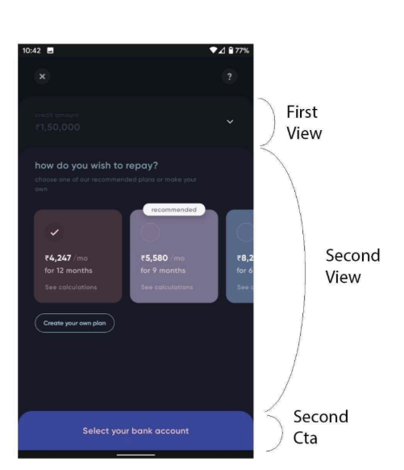
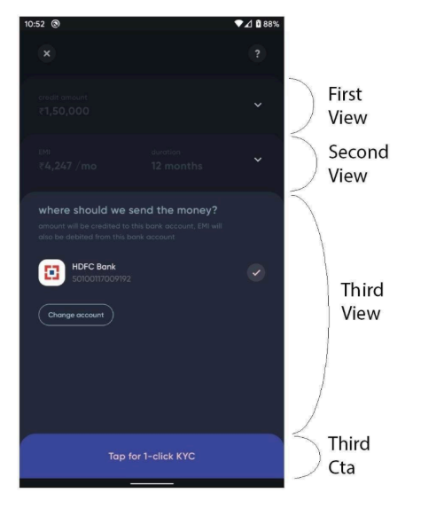

# Cred UI Clone -  Credit Slider 

This Flutter application provides a user-friendly interface for exploring credit options. Users can adjust a credit amount using a circular slider, view available EMI plans, and select a preferred plan.

## Screenshots

*   **View 1: Credit Amount Selection**

    

*   **View 2: EMI Plan Options**

    

*   **View 3: Plan Details and Bank Account Selection**

    

## Features

*   **Interactive Credit Slider:**  Adjust the credit amount using a visually appealing circular slider.
*   **EMI Plan Display:** View various EMI plans with different durations and monthly amounts.
*   **EMI Plan Selection:** Select a preferred EMI plan.
*   **Bank Account Integration:** Choose a bank account for the transaction.
*   **API Data Fetching:**  Data for the app is fetched from a mock API.
*   **Smooth Transitions:** Animated transitions between views provide a seamless user experience.
*   **Responsive Design:** The app is designed to be responsive and work on different screen sizes. (Mention if you've specifically tested on certain devices/screen sizes)

## Technologies Used

*   Flutter
*   Dart
*   http package (for API calls)

## Development

To run this project locally, you'll need Flutter installed.

1.  Clone this repository: `git clone https://github.com/thisis-gp/cred_ui_stack_views`
2.  Navigate to the project directory: `cd cred_ui_stack_views`
3.  Install dependencies: `flutter pub get`
4.  Run the app: `flutter run`

## Build APK
```
flutter build apk
```

## API Endpoint

The app uses the following API endpoint for fetching data: `https://api.mocklets.com/p6764/test_mint`

## Future Enhancements

*   Implement state management for more complex interactions.
*   Add unit and integration tests.
*   Implement error handling for API calls and data parsing.
*   Enhance UI/UX based on user feedback.
*   Publish to app stores.

